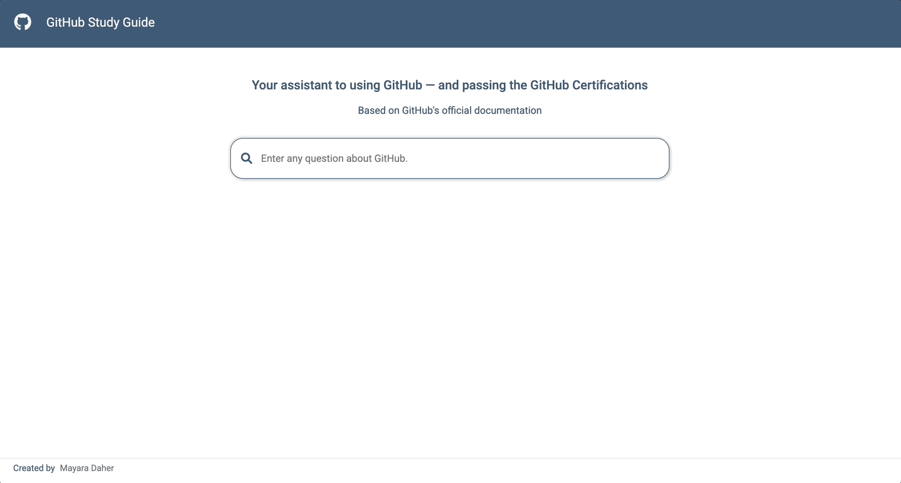

## GitHub Study Guide
 

  <a href="https://challengemichelin-122629525979.southamerica-east1.run.app">
    
    <h3 align="center">GitHub Study Guide</h3>
  </a>

    The GitHub Study Guide is an app designed to help users learn GitHub and prepare for certification exams.
   
   
  The app can be accessed
  <a href="https://githubguide-122629525979.southamerica-east1.run.app/" target="_blank">here »</a>
  

## Overview

## Technical Details

- **LangChain** is used for prompt orchestration, text processing, and embedding integration with large language models (LLMs) for retrieval-augmented generation (RAG).
- **Hugging Face** provides both the embeddings and the hosted language models accessed via API.
- **FAISS** is used for efficient vector similarity search and retrieval.
- **Frontend (Dash)** is the Python framework for building the interactive web user interface.
